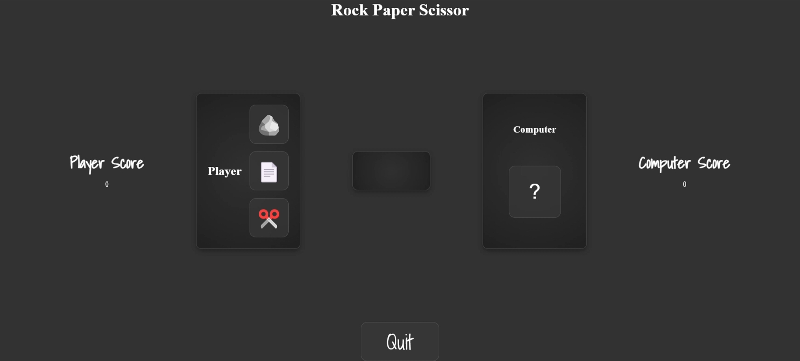

Rock Paper Scissors Game 🎮

A simple yet engaging Rock Paper Scissors game implemented using HTML, CSS, and JavaScript. This project demonstrates the use of event handling, DOM manipulation, and randomization for an interactive user experience.

Features 🌟

Play against the computer with classic Rock, Paper, and Scissors options.

Dynamic scoreboard to track player and computer scores.

Interactive result display after each round.

Option to quit and display the overall winner.

Clean and modern UI.

How to Play? 🕹️

1. Choose your option: Rock (🪨), Paper (📄), or Scissors (✂️).

2. The computer will randomly select its option.

3. The result is displayed:

Player wins.

Opponent wins.

It's a tie.

4. The scores are updated dynamically.

5. Click the Quit button to end the game and declare the overall winner.

Demo 🖥️

Technologies Used 🛠️

HTML5: Structuring the game elements.

CSS3: Styling the layout and adding animations.

JavaScript: Adding interactivity and game logic.

Credits 🙌

Developed by Balavignesh J. Inspired by the classic Rock Paper Scissors game.

